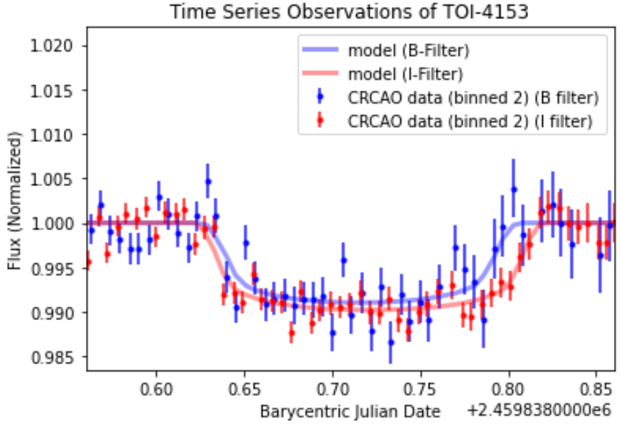

# Data Analyst Porfolio for Zachary Raup

Zachary's LinkedIn Profile:

Below is a select list of completed data and coding projects that I have completed

# [Project 1: Using MCMC in Python to Determine Parameter Values of an Exoplanet](TOI4153.ipynb)

This is part of an astrophysics research project that I presented at the 241 AAS meeting
  - Utilizes a Log likelyhood funtion and Monte Carlo Monte Carlo (MCMC) algorythm to understand the probability distribution of important exoplanet parameter values (Radius of Planet, Impact Paramter, and Time of Mid-Transit)
  - Creates a model of an exoplanet transit based on known parameters of TOI-4153
  - Code plots a light curve of the exoplanet transit based on photomtry data
  - Data was taken from the 0.61 m telescope at the CR Chambliss Astronomical Observatory in Kutztown, Pa.

## Key Components
### MCMC Algorithm: 
This is used to sample from the posterior distribution of your model parameters (like Radius of Planet, Impact Parameter, Time of Mid-Transit) given your data. It's great for exploring parameter space and understanding the uncertainties in your measurements.

### Log Likelihood Function: 
This function quantifies how well your model (presumably the exoplanet transit model) fits the observed photometry data. The MCMC algorithm uses this to evaluate the likelihood of different parameter values.

### Exoplanet Transit Model: 
You've mentioned creating a model of an exoplanet transit. This model likely uses physics-based equations to predict how the brightness of the star changes as the exoplanet transits in front of it.

Data Source: Photometry data from the CR Chambliss Astronomical Observatory. This data is crucial for fitting your model and validating your results.

Visualization: You mentioned plotting a light curve of the exoplanet transit based on the photometry data. Visualizing your results helps in understanding the quality of your fit and in communicating your findings.

Objective: Using MCMC (Markov Chain Monte Carlo) to determine probability distributions of exoplanet parameters (Radius of Planet, Impact Parameter, Time of Mid-Transit) based on photometry data.

Methodology:
  Develops a log likelihood function and applies MCMC algorithm to explore parameter space and quantify uncertainties.
  Constructs an exoplanet transit model using known parameters of TOI-4153.

Data Source: Utilizes photometry data obtained from the 0.61 m telescope at the CR Chambliss Astronomical Observatory in Kutztown, PA.

Visualization: Includes plotting of light curves to visualize and analyze the exoplanet transit based on the photometry data.

Presentation: Presented at the 241st AAS (American Astronomical Society) meeting.
    
   
